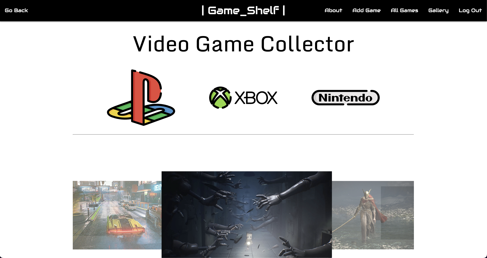
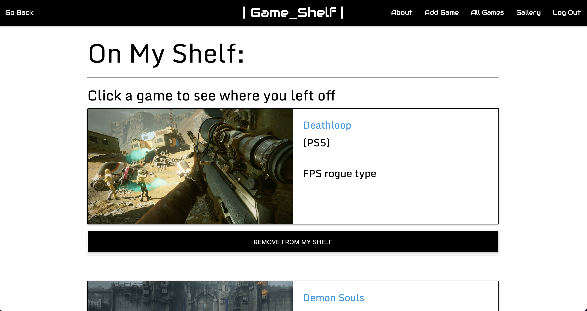
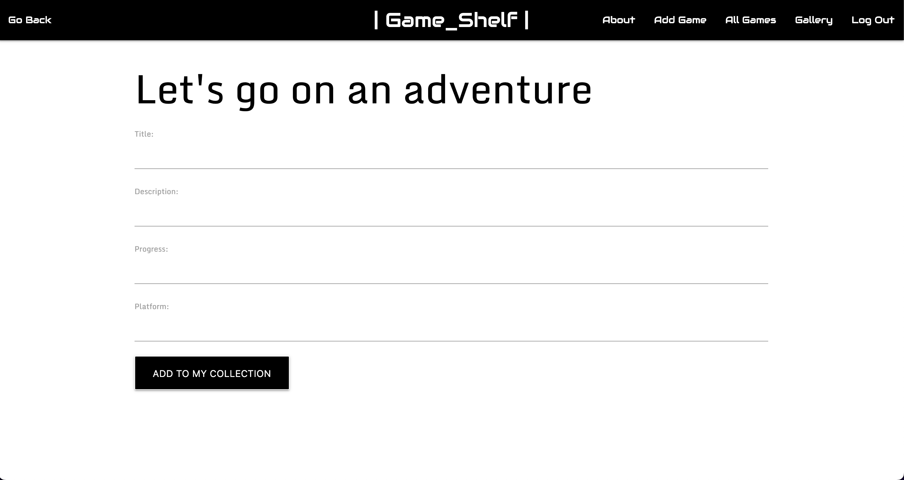
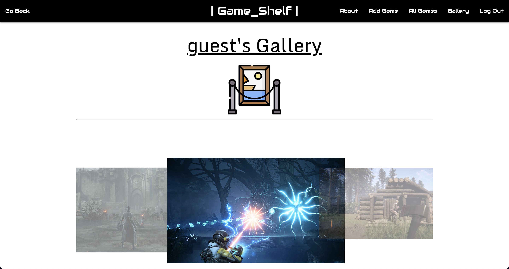
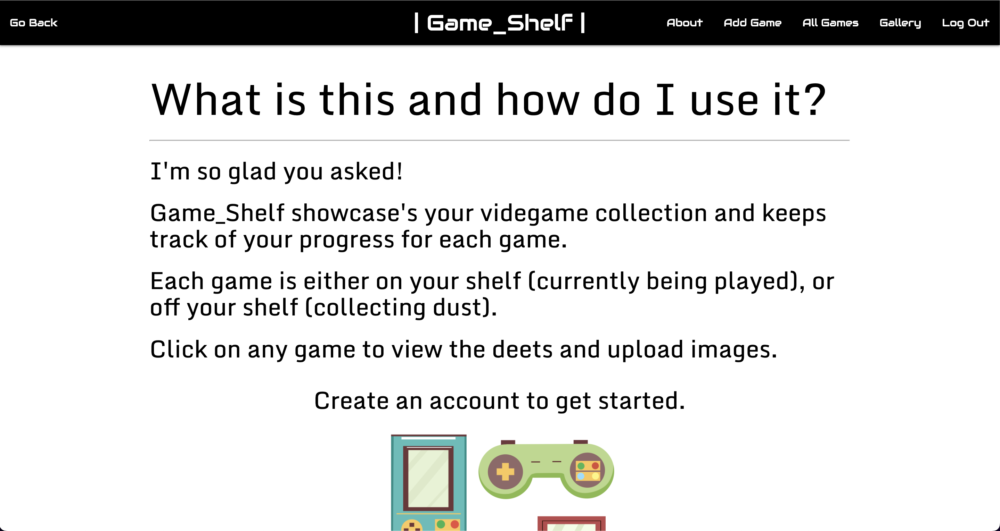

# Game_Shelf

## What is this?

Game_Shelf is an app that helps you keep track of your gaming library. After signing up, users can add to their collection within a simple UI. Add/Remove games from your shelf with the click of a button(currently playing/not currently playing), add photos, update progress, and admire your videogame shelf and all the digital adventures that you have.

### [Start Your Collection!](https://videogameshelf.herokuapp.com/)

## :camera_flash: Screenshots

<h3 align="center">Landing Page</h3>
 
<h3 align="center">Game Shelf</h3>
 
<h3 align="center">Add A Game</h3>
 
<h3 align="center">Gallery</h3>
 
<h3 align="center">About</h3>

## :computer: Technologies Used

 

## :spiral_notepad: Get Started

1.) Create an account or browse the app with Username: guest Pw: visitor123!
 
2.) Add a game, descibe the premise, log where you left off at your last save, and the platform.
 
3.)Click a game to uplaod photos, update your progress, or remove it.
 
4.)Decide whether you want to keep playing or take it off your shelf with the click of a button.
 
5.)Admire your collection!
